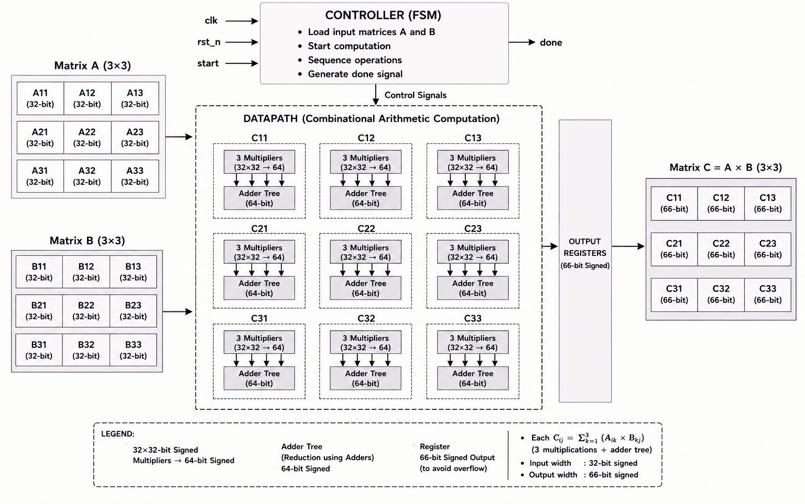

<div align="center">

# RTL-to-GDSII: 32-bit Matrix Multiplier of order 3×3

**An RTL-to-GDSII implementation of a 3×3 matrix multiplier with signed 32-bit operands using Cadence Tools (90 nm technology node).**


</div>

## Overview

This project explores the complete ASIC implementation flow, starting from Verilog RTL design and functional verification and progressing through logic synthesis, floorplanning, placement, clock tree synthesis, routing, physical verification and post-implementation analysis.

The design implements a 3×3 matrix multiplication:

$$C = A \times B$$

where **A** and **B** are 3×3 matrices with signed 32-bit elements.

Each output element is computed as:

$$C_{ij} = A_{i1} \times B_{1j} + A_{i2} \times B_{2j} + A_{i3} \times B_{3j}$$

The datapath uses parallel arithmetic computation, with **27 multiplications** and **18 additions** required for the complete 3×3 matrix multiplication.


## Technology & Tools

| Parameter | Details |
|---|---|
| Technology | 90 nm |
| HDL | Verilog |
| Functional Simulation | Cadence Incisive |
| Synthesis | Cadence Genus |
| Physical Design | Cadence Innovus |

> **Note:** Update the technology/library and other environment-specific paths in the Genus Tcl script, Innovus Tcl script and mmmc file to match your local setup before running the flow.


## Design Architecture

The design is organized into three main RTL blocks:

- **`multi_top`** – Top-level module connecting the controller and datapath.
- **`matrix_cont`** – Controller responsible for sequencing and control signals.
- **`matrix_datapath`** – Combinational arithmetic datapath block implementing the matrix multiplication.

The multiplication is performed in parallel, with each output element `Cij` obtained from the dot product of a row of matrix A and a column of matrix B.



## RTL-to-GDSII Flow

The complete implementation flow followed in this project is:

```text
RTL Design
    │
    ▼
Functional Simulation
    │
    ▼
Logic Synthesis
    │
    ▼
Floorplanning
    │
    ▼
Power Planning
    │
    ▼
Placement
    │
    ▼
Clock Tree Synthesis (CTS)
    │
    ▼
Routing
    │
    ▼
Physical Verification (DRC)
    │
    ▼
Timing, Power & Area Analysis
```

## Implementation Results

| Metric | Result |
|---|---:|
| Clock Frequency | 100 MHz |
| Standard Cell Count | 43,588 |
| Cell Area | 432,042.293 µm² |
| Critical Path Slack | +37.8 ps |
| Total Negative Slack (TNS) | 0 ps |
| Timing Closure | Achieved ✅ |
| Total Power | 38.797 mW |
| DRC Violations | 0 ✅ |

## Reports

The following reports are included to document the synthesis and implementation results:

| Report | Description |
|---|---|
| **Area Report** | Standard cell count and cell area |
| **Timing Report** | Critical path timing and slack |
| **Power Report** | Estimated power consumption |
| **QoR Report** | Overall quality-of-results metrics |


## Key Learnings

- **Tool setup matters.** Getting `init_design` to cooperate highlighted that understanding the tool environment is just as important as knowing the RTL design.
- **Floorplanning is iterative.** Reducing the core utilization from 65% to 55% improved routability and made the later implementation stages smoother.
- **Reports need interpretation, not just generation.** Understanding QoR, area, power, and timing reports was an important part of evaluating the implementation.
- **Backend implementation involves trade-offs.** Decisions made during floorplanning and optimization can influence timing, congestion, area, and power in later stages.

## Future Work

- [ ] Explore further timing, power, and area optimization
- [ ] Compare different matrix multiplier architectures
- [ ] Perform LVS and additional physical verification

## Author

**Bhoomika P**

M.Tech in VLSI and Nanotechnology  
Ramaiah University of Applied Sciences, Bengaluru

## License

This project is released under the [MIT License](LICENSE).
